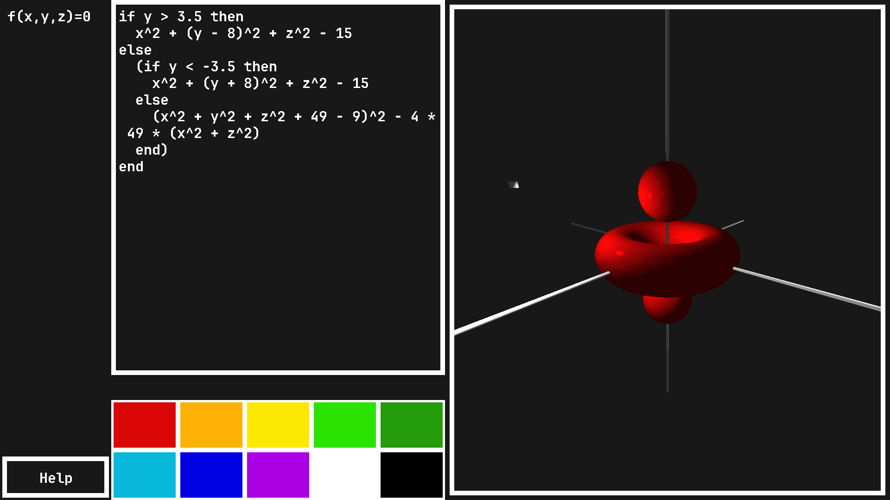

# 3D Graphing Calculator

In this project almost everything is made from scratch, except that I use [GLEW](https://glew.sourceforge.net/) and [RGFW](https://github.com/ColleagueRiley/RGFW).

Project currently supports only Linux machines using X11 and uses gcc as the compiler. To compile just run ```make```.

Parsing and rendering of TTF (True Type Font) is done from scratch. Data structures used are generic and in a [stb](https://github.com/nothings/stb) style single header, I have a seperate repository for the implementation [cylibx](https://github.com/FilipConic/cylibx).

To use the application you can just input an **implicit** function of x, y and z, make sure there aren't any other parameters.
The implicit function provided is expected to be in a form of ```f(x, y, z) = 0```.
When you are happy with your function compile and render it with \<Ctrl-R\>.

To move around the scene use WASD and \<C-'-'\>, \<C-'-'\>, \<C-'='\> for moving the camera closer and further.
Similarly use arrow keys and \<C-','\>, \<C-','\> for moving the light around.




## Documentation

 - [Learn OpenGL](https://learnopengl.com/Introduction)
 - [Coding Adventures: Rendering Text](https://www.youtube.com/watch?v=SO83KQuuZvg&t=1909s)
 - [A brief look at Text Rendering](https://www.youtube.com/watch?v=qcMuyHzhvpI&t=996s)
 - [TrueType Reference Manual](https://developer.apple.com/fonts/TrueType-Reference-Manual/)
 - [Triangulation By Ear Clipping Paper](https://www.geometrictools.com/Documentation/TriangulationByEarClipping.pdf)
 - [Polygon Triangulation \[1\] - Overview of Ear Clipping](https://www.youtube.com/watch?v=QAdfkylpYwc)
 - [Polygon Triangulation \[2\] - Ear Clipping Implementation in Code](https://www.youtube.com/watch?v=hTJFcHutls8)
 - [Top Down Parsing by Vaughan R. Pratt](https://dl.acm.org/doi/pdf/10.1145/512927.512931)
 - [Top Down Parser example in Rust](https://matklad.github.io/2020/04/13/simple-but-powerful-pratt-parsing.html)
 - [Original Marching Cubes paper by William E. Lorensen and Harvey E. Cline](https://www.cs.toronto.edu/~jacobson/seminar/lorenson-and-cline-1987.pdf)
 - [Marching Cubes TriTable for lookup](https://gist.github.com/dwilliamson/c041e3454a713e58baf6e4f8e5fffecd)
 - [Metaballs used as examples](https://en.wikipedia.org/wiki/Metaballs)
 - [Wavefront .obj file](https://en.wikipedia.org/wiki/Wavefront_.obj_file)
 - [The OBJ File Format](https://www.scratchapixel.com/lessons/3d-basic-rendering/obj-file-format/obj-file-format.html)

Matrix math:
 - [Rotation Matrix](https://en.wikipedia.org/wiki/Rotation_matrix)
 - [Transformation Matrix](https://en.wikipedia.org/wiki/Transformation_matrix)
 - [Perspective Matrix](https://www.mathematik.uni-marburg.de/~thormae/lectures/graphics1/graphics_6_1_eng_web.html#1)
 - [Projection Matrix](https://www.songho.ca/opengl/gl_projectionmatrix.html#perspective)

StackOverflow:

 - [How to determine if a list of polygon points are in clockwise order?](https://stackoverflow.com/questions/1165647/how-to-determine-if-a-list-of-polygon-points-are-in-clockwise-order)
 - [Check if polygon is inside a polygon](https://stackoverflow.com/questions/4833802/check-if-polygon-is-inside-a-polygon)
 - [How to determine if a point is in a 2D triangle?](https://stackoverflow.com/questions/2049582/how-to-determine-if-a-point-is-in-a-2d-triangle)
